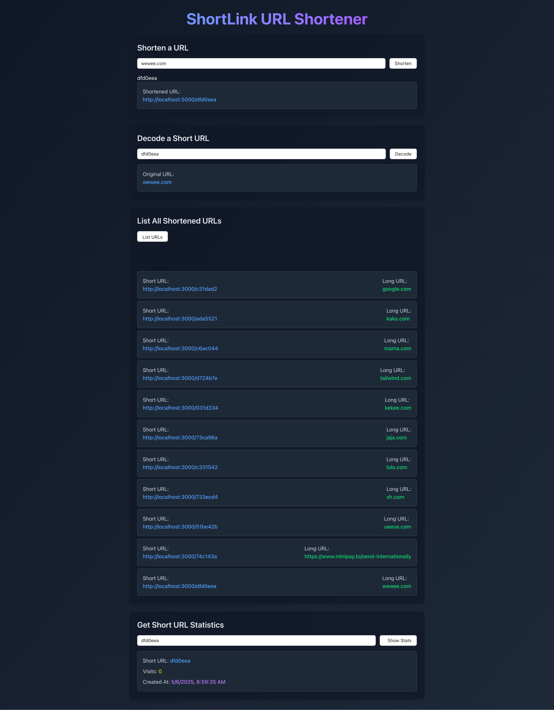

## Installation (make sure you have node version 18+)

```bash
$ npm install
```

## Running the app

```bash
# development
$ npm run start
```

Access the code on http://localhost:3000/

## Fill the form as shown in the image




            
